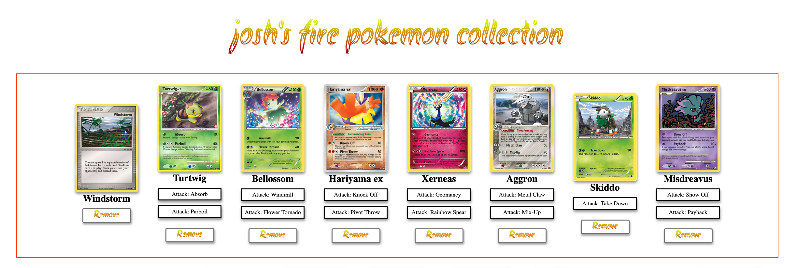

# Poke Fire

we will be useing [pokemon the card game API](https://pokemontcg.io/) to build our app today

Specifically this endpoint https://api.pokemontcg.io/v1/cards

alternatively if you are a Magic The Gathering Fan, use this one

https://api.magicthegathering.io/v1/cards

HTTP request allow you to request a resource living on a particular server
there are many HTTP libraries for JavaScript including a native HTTP fetch function, we will use `Axios` as this suits our needs for requesting data
